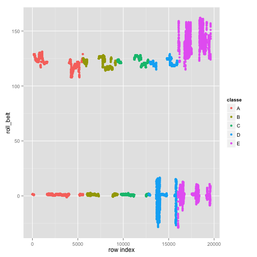

Classification with KNN Algorithm
========================================================
I used the humble KNN classifier operating on 8 principal components. I was able to achieve about 92% accuracy on the testing set that I created from the training set. On the actual assignment problems, I was able to get 19 correct, leading to a prediction accuracy of 95%. 

I could have achieved, like many in the forums did, 100 % accuracy using a random forest approach, but I did not do this for three reasons: (1) The knn classifier is simple and easy to understand and I was able to understand its mechanics well. I am not as clear on the internal workings of the random forest classifier and I wanted to stick with something that I understood well. (2) The knn classifier took less than 2 minutes to complete on my iMac and (3) It only took me about five hours total to develop the algorithm and write the necessary R code. 

Data Preprocesing
=====================
First we load the caret package and the ggplot2 package for plotting. Next, we load the training set. Note that blanks are assigned "NA". 

```r
library(caret)
```

```
## Loading required package: lattice
## Loading required package: ggplot2
```

```r
library(ggplot2)
rm(list = ls())
set.seed(12345)

# Load the training dataset. Replace blanks with NA
tr1 <- read.csv("~/Google Drive/documents/R/coursera/Practical Machine Learning/Assignment/pml-training.csv", 
    header = TRUE, na.strings = c("", "NA"))

# Remove columns with at least one NA in it
df <- tr1[, colSums(is.na(tr1)) == 0]
```


The data in the training set are arranged sequentially, i.e., all "A" classes are listed first, followed by all "B" classes and so on. This leads to a high correlation between the index variable and classe. This is misleading and potentially dangerous. For instance, when the {\it roll_belt} variable is plotted against the index number (X), we get the following: 


```r
qplot(X, roll_belt, data = df, color = classe)
```

 


Notice the nice separation with respect to the index variable, X. This is due to the sequential data ordering and surely we cannot expect the actual test to have the classes so ordered. Hence we remove the first column from our analysis and randomize the row order, just to be sure. 


```r
# Remove columns with at least one NA in it
df <- tr1[, colSums(is.na(tr1)) == 0]
# Remove time stamps etc. In particular, remove the first column. There is a
# strong correlation between the row number and the classe variable !
df <- df[, c(-1, -2, -3, -4, -5, -6, -7)]

# Randomize the order
df <- df[sample(nrow(df)), ]
# Use this to check random order and also to make sure that index is gone:
head(df[, c(1:5, 53)])
```

```
##       roll_belt pitch_belt yaw_belt total_accel_belt gyros_belt_x classe
## 14146      1.58       6.95    -93.6                3         0.03      D
## 17184    156.00       9.03     39.7               26         0.40      E
## 14931    124.00     -41.90    165.0               17         0.19      D
## 17385    133.00      10.60     55.0               18         0.02      E
## 8956       0.36       2.40    -88.8                3         0.08      B
## 3264       0.33       5.11    -88.0                5         0.05      A
```

We also remove some other columns: those with NAs in them, those with the time stamps and so on. There are 160 columns in the raw data and we remove all columns with at least one NA in it. If there are very few predictors, then it may be necessary to do some imputing, but with 160 of them, we can afford to throw some of them away.

Next, we do the usual steps to partition the training data into a training set and a test set: 

```r
inTrain <- createDataPartition(y = df$classe, p = 0.75, list = FALSE)
training <- df[inTrain, ]
testing <- df[-inTrain, ]
```


Algorithm Development and Parameter Estimation
==============================================
I used a KNN classifier with n=5 that worked on eight predictors. These eight predictors are the first eight principal components of the training data set. Using eight principal components captures about 95% of the variance. Very little is gained by increasing the number of predictors at this point and doing so only increases the computing time needed for almost no added benefit. The following code does the actual model building: 

```r
preProc <- preProcess(training[, -53], method = "pca", pcaComp = 8)
trainPC <- predict(preProc, training[, -53])
modelFit <- train(training$classe ~ ., method = "knn", data = trainPC)
```


That five nearest neighbors provide the optimum result is found by the train function itself. The following plot shows the decrease in error as a function of the number of nearest neighbors: 

```r
plot(modelFit)
```

 

The train function above applies cross-validation using default bootstrapping method. 

Results
=======
The algorithm developed above produced about 92% accuracy for the testing set: 

```r
testPC <- predict(preProc, testing[, -53])
confusionMatrix(testing$classe, predict(modelFit, testPC))
```

```
## Confusion Matrix and Statistics
## 
##           Reference
## Prediction    A    B    C    D    E
##          A 1330   18   30   13    4
##          B   43  847   34   20    5
##          C   21   25  781   21    7
##          D   13    6   62  723    0
##          E   16   11   18   15  841
## 
## Overall Statistics
##                                         
##                Accuracy : 0.922         
##                  95% CI : (0.914, 0.929)
##     No Information Rate : 0.29          
##     P-Value [Acc > NIR] : < 2e-16       
##                                         
##                   Kappa : 0.901         
##  Mcnemar's Test P-Value : 3.9e-11       
## 
## Statistics by Class:
## 
##                      Class: A Class: B Class: C Class: D Class: E
## Sensitivity             0.935    0.934    0.844    0.913    0.981
## Specificity             0.981    0.974    0.981    0.980    0.985
## Pos Pred Value          0.953    0.893    0.913    0.899    0.933
## Neg Pred Value          0.973    0.985    0.964    0.983    0.996
## Prevalence              0.290    0.185    0.189    0.162    0.175
## Detection Rate          0.271    0.173    0.159    0.147    0.171
## Detection Prevalence    0.284    0.194    0.174    0.164    0.184
## Balanced Accuracy       0.958    0.954    0.913    0.947    0.983
```


Also, when you plot the first two principal components, nice separation into five distinct regions corresponding to the five classes: 

```r
qplot(x = testPC[, 1], y = testPC[, 2], data = testing)
```

 


When the algorithm is applied to the "real" testing data set in the assignment, I got 18 out of 20 correct. I was able to get a slight improvement by using the bootstrap aggregating method (aka "bagging"). I simply ran the code with different starting seeds and averaged the predictions. This way, accuracy improved to 19/20. 

Like I said in the beginning, it is possible to get 100% accuracy with a random forest approach, but it take a lot longer to run. The algorithm described above needed only 2 minutes to run on my iMac and gave me 95% prediction accuracy. 

